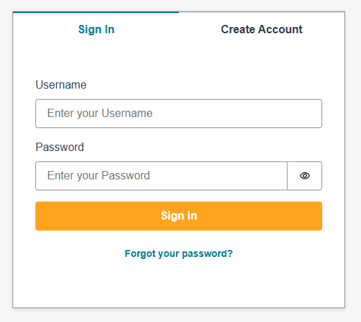
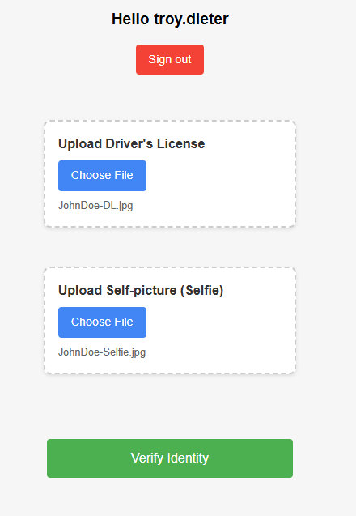
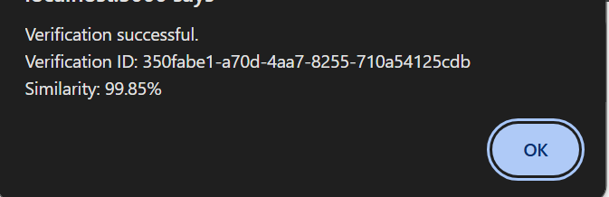
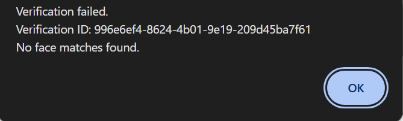
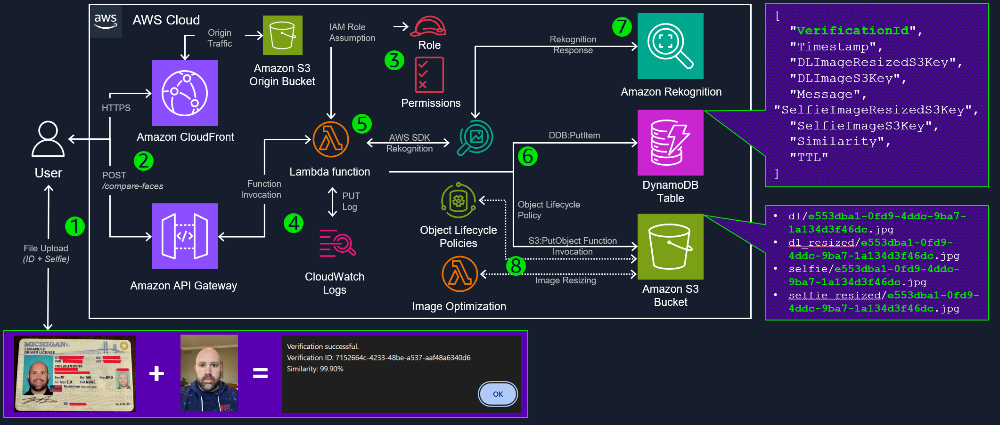
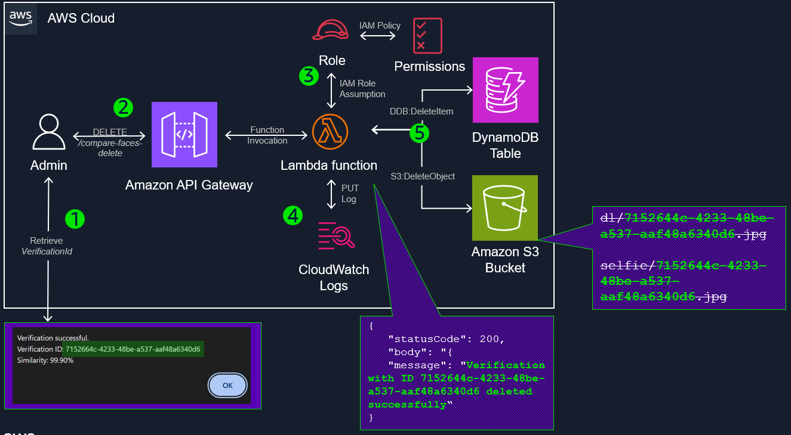
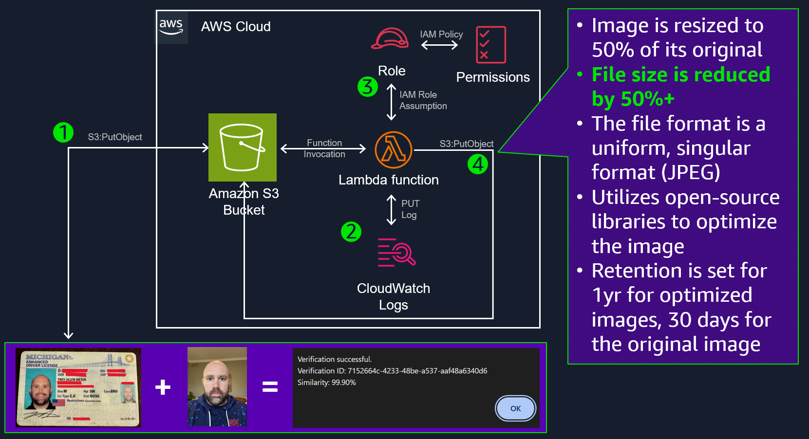

# ID Plus Selfie Identity Verification with Amazon Rekognition

A robust solution for digital identity verification using Amazon Rekognition.

## Overview

This project provides a serverless API for comparing a user's selfie with their driver's license photo, leveraging the power of Amazon Rekognition for accurate face matching.




#### Confirmation of match:


#### No match found:


## Architecture

### AWS Solution Architecture
#### /compare-faces

1. User uploads files (ID + Selfie) to the system.
2. Amazon API Gateway receives the POST request at the `/prod/CompareApi` endpoint.
3. IAM Role assumes the necessary permissions for the Lambda function.
4. CloudWatch Logs record the Lambda function's execution details.
5. The AWS Lambda function uses the AWS SDK to interact with Amazon Rekognition.
6. The Rekognition response is stored in a DynamoDB table with the `VerificationId` attribute in the item. The object is also stored in Amazon S3 for post-processing. (see: the purple boxes shown to the right)
7. Amazon Rekognition processes the images and returns a response (box at the bottom).

#### /compare-faces-delete

1. Admin user receives a request to delete an identity that has been verified. They retrieve the `VerificationId` value as initially registered by the user.
2. A `DELETE` API call is made to API Gateway with `VerificationId` as a parameter and the necessary `x-api-key` value in the header.
3. IAM Role assumes the necessary permissions for the Lambda function.
4. CloudWatch Logs record the Lambda function's execution details.
5. The item in the DynamoDB table, based on the primary key `VerificationId` is deleted along with the Amazon S3 objects (one of each). The response is sent back via the API call that it has been deleted successfully.

#### /compare-faces-resizing

1. The drivers license (ID) and selfie are uploaded.
2. CloudWatch Logs record the Lambda function's execution details. The `eventSourceMapping` for Amazon S3 objects occurs, invoking the function.
3. IAM Role assumes the necessary permissions for the Lambda function.
4. The file is resized and optimized, and stored in the `dl_resized` or `selfie_resized` key (directories) in the Amazon S3 upload bucket. The lifecycle policy applies for 1yr/optimized and 30days/original.

# Setup
## 01 - Deployment - Backend (`IdPlusSelfieStack`)

This project is deployed using [AWS CDK](https://github.com/aws/aws-cdk) (`2.175.1`) for infrastructure as code. Follow these steps to deploy:

1. Ensure you have an AWS account and an AWS IAM user/role with appropriate permissions.

2. Set up the AWS CLI: [AWS CLI Configuration Guide](https://docs.aws.amazon.com/cli/latest/userguide/cli-chap-configure.html)

3. Install AWS CDK: [CDK Python Guide](https://docs.aws.amazon.com/cdk/v2/guide/work-with-cdk-python.html)

4. Change directory to the backend:
   ```
   cd backend
   ```

4. Navigate to the project directory and create a virtual environment:
   - Windows: `.venv\Scripts\activate`
   - Mac/Linux: `source .venv/bin/activate`

5. Install dependencies: `python -m pip install -r requirements.txt`

6. **LEAVE** the following commented in `backend/app.py`, it will be un-commented after the frontend is deployed:

    ```
    # SiteDistributionStack(app, "SiteDistributionStack",
    #                   env=cdk.Environment(account=os.getenv(
    #                       'CDK_DEFAULT_ACCOUNT'), region=os.getenv('CDK_DEFAULT_REGION')),
    #                   )
    ```

6. Deploy the stack: `cdk deploy --all`

## 02 - Deployment - Frontend

Before you begin, ensure you have the following installed:
- Node.js (v14.0.0 or later)
- npm (v6.0.0 or later)

1. Change directory to the frontend:
   ```
   cd frontend
   ```

2. Install dependencies:
   ```
   npm install --legacy-peer-deps
   ```

3. Set up environment variables:
   - Copy the `.env.example` file to a new file named `.env`:
     ```
     cp .env.example.env .env
     ```
   - Open the `.env` file and replace the placeholder values with your actual AWS credentials and S3 bucket information:
     ```
      REACT_APP_API_URL=https://example.execute-api.REGION.amazonaws.com/prod
      REACT_APP_API_KEY=xyz123
      REACT_APP_USERPOOL_CLIENTID=example123
      REACT_APP_USERPOOL_ID=us-east-1_example
      ```

4. Build it:
   ```
   npm run build --legacy-peer-deps
   ``` 

## 03 - Deployment - Backend (`SiteDistributionStack`)

1. Change back to the backend directory:
    ```
    cd ../backend
    ```

2. Uncomment the `SiteDistributionStack` in `app.py` as shown:

    ```
      SiteDistributionStack(app, "SiteDistributionStack",
                        env=cdk.Environment(account=os.getenv(
                        'CDK_DEFAULT_ACCOUNT'), region=os.getenv('CDK_DEFAULT_REGION')),
                        )
    ```

3. Deploy the stack, which now includes both the `IdPlusSelfieStack` and the `SiteDistributionStack`:

    ```
    cdk deploy --all
    ```

4. Use the `SiteDistributionStack.SiteDistributionName` CloudFormation output to visit the site:

    ```
    SiteDistributionStack.SiteDistributionName = dibc4iuf2q3bb.cloudfront.net
    ```

    and enter the username (remember, it's `demo` as the username and `demo` as the password.)

## TO-DO
* M̵i̵g̵r̵a̵t̵e̵ ̵t̵h̵e̵ ̵A̵W̵S̵ ̵C̵o̵g̵n̵i̵t̵o̵ ̵p̵r̵o̵c̵e̵s̵s̵ ̵f̵r̵o̵m̵ ̵m̵a̵n̵u̵a̵l̵ ̵c̵r̵e̵a̵t̵i̵o̵n̵ ̵t̵o̵ ̵u̵s̵i̵n̵g̵ ̵A̵W̵S̵ ̵C̵D̵K̵.̵ ̵C̵u̵r̵r̵e̵n̵t̵l̵y̵,̵ ̵y̵o̵u̵ ̵m̵u̵s̵t̵ ̵m̵a̵n̵u̵a̵l̵l̵y̵ ̵p̵r̵o̵v̵i̵s̵i̵o̵n̵ ̵t̵h̵e̵ ̵A̵W̵S̵ ̵C̵o̵g̵n̵i̵t̵i̵o̵ ̵U̵s̵e̵r̵ ̵P̵o̵o̵l̵ ̵a̵n̵d̵ ̵s̵e̵t̵ ̵t̵h̵e̵ ̵n̵e̵c̵e̵s̵s̵a̵r̵y̵ ̵a̵t̵t̵r̵i̵b̵u̵t̵e̵s̵.̵ ̵O̵n̵c̵e̵ ̵t̵h̵a̵t̵ ̵i̵s̵ ̵c̵r̵e̵a̵t̵e̵d̵,̵ ̵y̵o̵u̵ ̵e̵x̵p̵o̵r̵t̵ ̵t̵h̵e̵ ̵U̵s̵e̵r̵P̵o̵o̵l̵ ̵`̵C̵l̵i̵e̵n̵t̵I̵D̵`̵ ̵a̵n̵d̵ ̵`̵I̵D̵`̵ ̵t̵o̵ ̵t̵h̵e̵ ̵`̵.̵\̵f̵r̵o̵n̵t̵e̵n̵d̵\̵.̵e̵n̵v̵`̵ ̵f̵i̵l̵e̵.̵
* U̵p̵d̵a̵t̵e̵ ̵t̵h̵e̵ ̵A̵P̵I̵ ̵c̵a̵l̵l̵s̵ ̵t̵o̵ ̵i̵n̵c̵l̵u̵d̵e̵ ̵t̵h̵e̵ ̵u̵s̵e̵r̵ ̵s̵e̵s̵s̵i̵o̵n̵ ̵t̵o̵k̵e̵n̵.̵
* A̵d̵d̵ ̵t̵h̵e̵ ̵C̵o̵g̵n̵i̵t̵o̵ ̵U̵s̵e̵r̵ ̵P̵o̵o̵l̵ ̵A̵u̵t̵h̵o̵r̵i̵z̵e̵r̵ ̵t̵o̵ ̵t̵h̵e̵ ̵A̵P̵I̵ ̵

## Deployment Recap

1. Deploy the backend (`./backend`) using AWS CDK (`cdk deploy --all`) leaving the `SiteDistributionStack` stack commented.

2. Load the .env file (using `.env.example` in the `./frontend` directory) and deploy the frontend (`./frontend`) using NodeJS (`npm run build`)

3. Uncomment the `SiteDistributionStack` in `app.py` and use `cdk deploy --all`

4. Destroy when done:

   ```
   cd ../backend
   cdk destroy
   ```

## Clean Up

To remove all deployed backend resources:

```
cdk destroy
```

## Security

See [CONTRIBUTING](CONTRIBUTING.md#security-issue-notifications) for more information.

## License

This project is licensed under the MIT-0 License. See the [LICENSE](LICENSE) file for details.