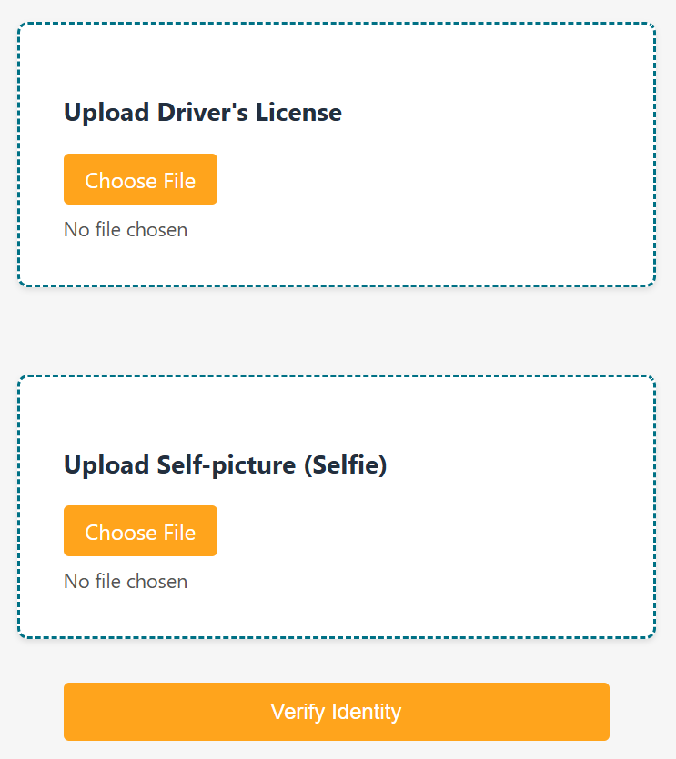
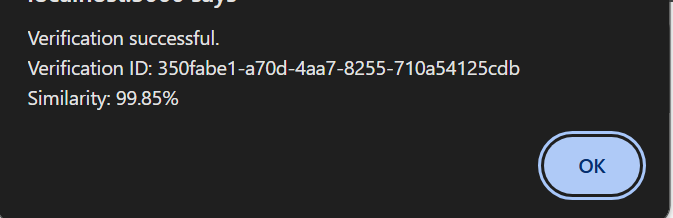
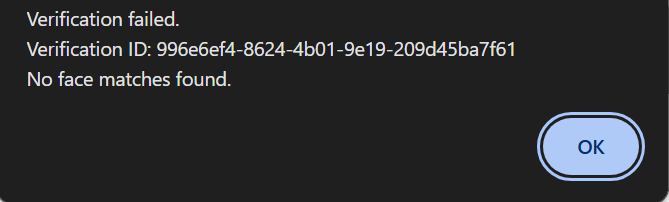
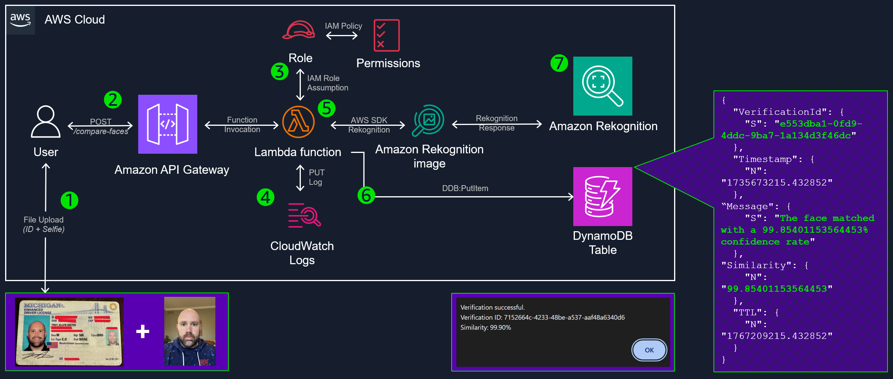

# ID Plus Selfie Identity Verification with Amazon Rekognition

A robust solution for digital identity verification using Amazon Rekognition.

## Overview

This project provides a serverless API for comparing a user's selfie with their driver's license photo, leveraging the power of Amazon Rekognition for accurate face matching.



#### Confirmation of match:


#### No match found:


## Architecture

### AWS Solution Architecture

1. User uploads files (ID + Selfie) to the system.
2. Amazon API Gateway receives the POST request at the `/prod/CompareApi` endpoint.
3. IAM Role assumes the necessary permissions for the Lambda function.
4. CloudWatch Logs record the Lambda function's execution details.
5. The AWS Lambda function uses the AWS SDK to interact with Amazon Rekognition.
6. The Rekognition response is stored in a DynamoDB table with the `VerificationId` attribute in the item. (see: the purple purple box)
7. Amazon Rekognition processes the images and returns a response (box at the bottom).

## Deployment - Backend

This project is deployed using [AWS CDK](https://github.com/aws/aws-cdk) (`2.173.4`) for infrastructure as code. Follow these steps to deploy:

1. Ensure you have an AWS account and an AWS IAM user/role with appropriate permissions.

2. Set up the AWS CLI: [AWS CLI Configuration Guide](https://docs.aws.amazon.com/cli/latest/userguide/cli-chap-configure.html)

3. Install AWS CDK: [CDK Python Guide](https://docs.aws.amazon.com/cdk/v2/guide/work-with-cdk-python.html)

4. Change directory to the backend:
   ```
   cd backend
   ```

4. Navigate to the project directory and create a virtual environment:
   - Windows: `.venv\Scripts\activate`
   - Mac/Linux: `source .venv/bin/activate`

5. Install dependencies: `python -m pip install -r requirements.txt`

6. Deploy the stack: `cdk deploy`

## Deployment - Frontend

Before you begin, ensure you have the following installed:
- Node.js (v14.0.0 or later)
- npm (v6.0.0 or later)

1. Change directory to the frontend:
   ```
   cd frontend
   ```

2. Install dependencies:
   ```
   npm install
   ```

3. Set up environment variables:
   - Copy the `.env.example` file to a new file named `.env`:
     ```
     cp .env.example.env
     ```
   - Open the `.env` file and replace the placeholder values with your actual AWS credentials and S3 bucket information:
     ```
      REACT_APP_API_URL=https://example.execute-api.REGION.amazonaws.com/api
      REACT_APP_API_KEY=xyz123

4. Build and start:
   ```
   npm run build
   npm run start
   ``` 

## Deployment Recap

1. Deploy the backend (`./backend`) using AWS CDK (`cdk deploy`)

2. Load the .env file (using `.env.example` in the `./frontend` directory) and deploy the frontend (`./frontend`) using NodeJS (`npm run build` and `npm run start`)

3. Destroy when done:

   ```
   cd ../backend
   cdk destroy
   ```

# API Documentation

## Endpoints

### Compare Faces

Create a new face comparison.

- URL: `/compare-faces`
- Method: `POST`
- Auth: API Key required
- Content-Type: `application/json`

Request Body:
```
{
  "selfie": "base64_encoded_selfie_image",
  "dl": "base64_encoded_drivers_license_image"
}
```

Response:
```
{
  "verificationId": "string",
  "result": {
    "similarity": "number",
    "message": "string",
    "timestamp": "string (ISO 8601 format)"
  }
}
```

### Delete Comparison

Delete an existing face comparison.

- URL: `/compare-faces-delete`
- Method: `DELETE`
- Auth: API Key required
- Query Parameters:
  - `verificationId`: string (required)

Response:
```
{
  "message": "string"
}
```

## Authentication

All endpoints require an API key to be included in the request headers:

`X-Api-Key: your_api_key_here`

## Rate Limiting

The API is subject to the following rate limits:
- Rate limit: 10 requests per second
- Burst limit: 2 requests

## Error Responses

The API uses standard HTTP response codes to indicate the success or failure of requests. In case of errors, additional information may be provided in the response body.

Common error codes:
- 400: Bad Request
- 401: Unauthorized
- 403: Forbidden
- 404: Not Found
- 429: Too Many Requests
- 500: Internal Server Error

## Clean Up

To remove all deployed backend resources:

```
cdk destroy
```

## Security

See [CONTRIBUTING](CONTRIBUTING.md#security-issue-notifications) for more information.

## License

This project is licensed under the MIT-0 License. See the [LICENSE](LICENSE) file for details.