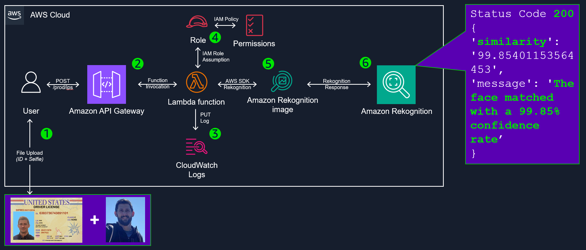

# ID Plus Selfie Identity Verification with Amazon Rekognition

A robust solution for digital identity verification using Amazon Rekognition.

## Overview

This project provides a serverless API for comparing a user's selfie with their driver's license photo, leveraging the power of Amazon Rekognition for accurate face matching.

## Architecture

### AWS Solution Architecture

1. User uploads files (ID + Selfie) to the system.
2. Amazon API Gateway receives the POST request at the /prod/ips endpoint.
3. CloudWatch Logs record the Lambda function's execution details.
4. IAM Role assumes the necessary permissions for the Lambda function.
5. Lambda function uses the AWS SDK to interact with Amazon Rekognition.
6. Amazon Rekognition processes the images and returns a response (see purple box to the right).

### AWS Resource Flow / Connectivity


## How It Works

1. User submits a POST request to the REST API with base64 encoded images of their selfie and driver's license.
2. The Lambda function processes the request and uses Amazon Rekognition to compare the faces.
3. A confidence percentage is returned, indicating the likelihood of a match.

## Deployment

This project uses AWS CDK for infrastructure as code. Follow these steps to deploy:

1. Ensure you have an AWS account and a user with appropriate permissions.
2. Set up the AWS CLI: [AWS CLI Configuration Guide](https://docs.aws.amazon.com/cli/latest/userguide/cli-chap-configure.html)
3. Install AWS CDK: [CDK Python Guide](https://docs.aws.amazon.com/cdk/v2/guide/work-with-cdk-python.html)
4. Clone the repository: `git clone <repository-url>`
5. Navigate to the project directory and create a virtual environment:
   - Windows: `.venv\Scripts\activate`
   - Mac/Linux: `source .venv/bin/activate`
6. Install dependencies: `python -m pip install -r requirements.txt`
7. Deploy the stack: `cdk deploy`

## Usage

To make API calls, use the `main.py` script in the `idplusselfie_api` directory:

1. Update the `SOURCE`, `TARGET`, `API_KEY` and `URL` variables in `.\idplusselfi_api\main.py`.
2. Run the script: `python main.py`

## Good to Know

- **AWS CDK**: Allows you to define cloud infrastructure in code and provision it through AWS CloudFormation.
- **Amazon Rekognition**: Provides pre-trained and customizable computer vision (CV) capabilities to extract information and insights from your images and videos.
- **API Gateway**: Manages the REST API, handling request/response cycles and integrating with Lambda.
- **Lambda**: Runs your code in response to events and automatically manages the underlying compute resources.

## Clean Up

To remove all deployed resources:

```
cdk destroy
```

## Security

See [CONTRIBUTING](CONTRIBUTING.md#security-issue-notifications) for more information.

## License

This project is licensed under the MIT-0 License. See the [LICENSE](LICENSE) file for details.